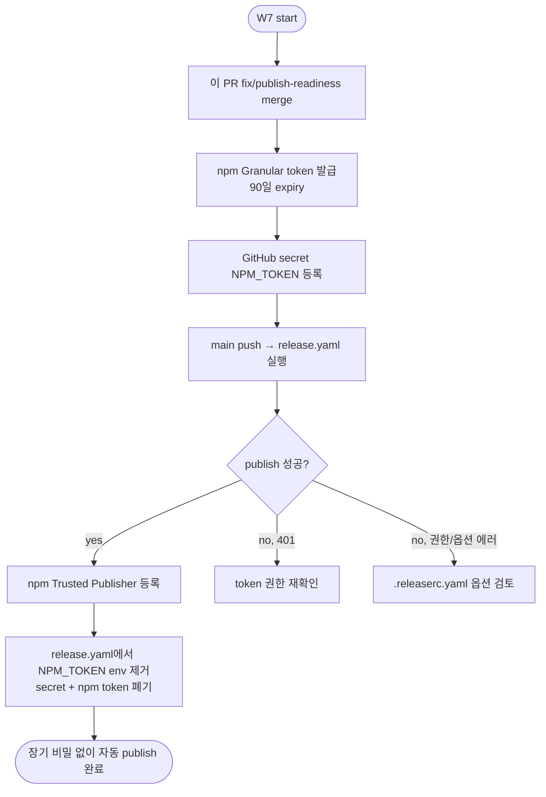

# W7 — NPM Publish Setup

최근 main push마다 release workflow가 `SemanticReleaseError: No npm token specified. (ENONPMTOKEN)`로 실패하고 있다. 이 문서는 **첫 번째 publish → OIDC 전환** 2단계 경로를 설명한다.

## Pre-flight (이번 PR에서 해결된 것)

| 항목 | Before | After |
|------|--------|-------|
| `package.json` `bin.af` | `./dist/cli.js` (파일 없음) | `./dist/index.js` ✓ |
| `dist/index.js` shebang | `#!/usr/bin/env bun` (Node-only 환경에서 실패) | `#!/usr/bin/env node` ✓ |
| `post-build.ts` | bun shebang 감지 못함 | Replace bun→node + unknown-shebang warn |
| `smoke-test.sh` | shebang 존재만 체크 | 정확히 `node` 셔뱅 + bin 타겟 파일 존재 모두 검증 |
| npm 패키지 이름 점유 | `akiflow-toolkit` 미등록 (`npm view` → 404) | 첫 publish로 자동 선점 |
| `semantic-release` 플러그인 버전 | `@semantic-release/npm@13.1.5` (OIDC auto-detect) | 그대로 사용 |
| `release.yaml` `id-token: write` | 이미 부여됨 | 그대로 사용 (OIDC 준비 완료) |

## Phase 1 — 첫 publish (NPM_TOKEN 필수)

npm Trusted Publisher 설정은 **패키지가 이미 존재해야** 가능하므로, 최초 한 번은 토큰 방식이 필수.

### 1.1 npm Granular Access Token 발급

1. https://www.npmjs.com 로그인 (없으면 가입)
2. 우상단 아바타 → **Access Tokens**
3. **Generate New Token → Granular Access Token**
4. 폼:
   | 필드 | 값 |
   |------|-----|
   | Token name | `akiflow-toolkit-ci-bootstrap` |
   | Expiration | 90 일 (OIDC 전환 후 폐기 예정이므로 짧게) |
   | Packages and scopes > Permissions | **Read and write** |
   | Select packages | **All packages** (첫 publish 전이라 `akiflow-toolkit`을 선택 불가) |
   | 2FA enforcement | Required 유지 |
5. **Generate Token** → 표시되는 토큰을 즉시 복사 (재확인 불가)

### 1.2 GitHub repo secret 등록

1. https://github.com/kty1965/akiflow-toolkit/settings/secrets/actions
2. **New repository secret**
3. Name: `NPM_TOKEN` · Value: 방금 복사한 토큰 · **Add secret**

`release.yaml`은 이미 `env.NPM_TOKEN: ${{ secrets.NPM_TOKEN }}`으로 참조 중 → 워크플로우 수정 필요 없음.

### 1.3 트리거: main으로 release workflow 재실행

이 PR(`fix/publish-readiness`)이 main에 merge되면 release workflow가 자동 실행된다. 직전까지의 conventional commits(`feat:`, `fix:`, `chore:`)을 분석해 **v1.0.0**을 만든다.

기대 결과:
- GitHub Releases에 `v1.0.0` 생성 + 4개 플랫폼 바이너리 첨부
- npm registry에 `akiflow-toolkit@1.0.0` publish
- `CHANGELOG.md` 자동 생성 및 `chore(release): 1.0.0 [skip ci]` 커밋 back-push
- `v1.0.0` 태그 생성

검증:
```bash
npm view akiflow-toolkit version
# → 1.0.0

gh release list --limit 1
# → v1.0.0  …  Published by github-actions[bot]
```

### 1.4 Local MCP 등록 경로가 여전히 동작하는지 (회귀 방지)

```bash
bun run build
bash scripts/smoke-test.sh
bun run scripts/mcp-live-demo.ts    # Tier 2 E2E
```

## Phase 2 — OIDC Trusted Publishing 전환

첫 publish 이후 npm registry에 패키지가 존재하므로 Trusted Publisher 설정 가능.

### 2.1 npm Settings → Trusted Publisher 등록

1. https://www.npmjs.com/package/akiflow-toolkit
2. **Settings** → **Trusted Publisher** (좌측 사이드바)
3. **Add Trusted Publisher** → **GitHub Actions** 선택
4. 폼:
   | 필드 | 값 |
   |------|-----|
   | Organization or user | `kty1965` |
   | Repository | `akiflow-toolkit` |
   | Workflow filename | `release.yaml` |
   | Environment name | (비워둠 — 필요하면 `npm-publish` 환경 생성 후 지정) |
5. **Add publisher**

### 2.2 release.yaml에서 NPM_TOKEN 제거

```diff
       - name: Run semantic-release
         env:
           GITHUB_TOKEN: ${{ secrets.GITHUB_TOKEN }}
-          NPM_TOKEN: ${{ secrets.NPM_TOKEN }}
         run: npx semantic-release
```

`@semantic-release/npm@13.1+`은 `NPM_TOKEN` 부재 + `id-token: write` permission 감지 시 **자동으로 OIDC 경로 사용** → 장기 비밀 없이 publish 성공.

### 2.3 secret + token 폐기

- GitHub repo → Settings → Secrets → **Delete** `NPM_TOKEN`
- npm → Access Tokens → 방금 만든 token **Delete**

### 2.4 Provenance 자동 첨부 확인

OIDC 경로로 publish되면 npm registry에 **✓ Provenance** 배지가 자동 표시된다. `npm view akiflow-toolkit --json | jq .dist.signatures`로 signed attestation 확인.

## 의사결정 트리



## 흔한 실패 & 처리

| 증상 | 원인 | 해결 |
|------|------|------|
| `ENONPMTOKEN` | secret 미등록 | 1.2 단계 수행 |
| `ENEEDAUTH` | token 만료 또는 권한 부족 | 토큰 재발급 + 권한 `Read and write` 확인 |
| `E403 You do not have permission to publish` | 패키지 name 이미 점유됨 or 2FA 요구됨 | `package.json` name 변경 또는 2FA 예외 (automation token 전환) |
| `EPUBLISHCONFLICT` | 같은 버전 재publish 시도 | 다음 commit으로 버전 올림 (semantic-release가 자동) |
| Provenance 배지 안 뜸 | OIDC 경로 안 탐 | `NPM_TOKEN` 완전히 제거됐는지 확인 + `id-token: write` 유지 |

## References

- `@semantic-release/npm` v13 OIDC 지원: https://github.com/semantic-release/npm/releases/tag/v13.1.0
- npm Trusted Publishing: https://docs.npmjs.com/trusted-publishers
- GitHub OIDC for npm: https://docs.github.com/en/actions/deployment/security-hardening-your-deployments/configuring-openid-connect-in-npm-package-registry
- 관련 ADR: (없음 — 이 문서가 최초 publish 절차 기록)
- 이전 failure logs: `gh run list --workflow=release.yaml`
