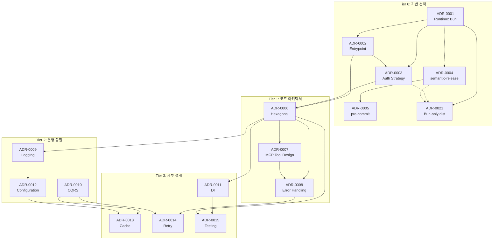
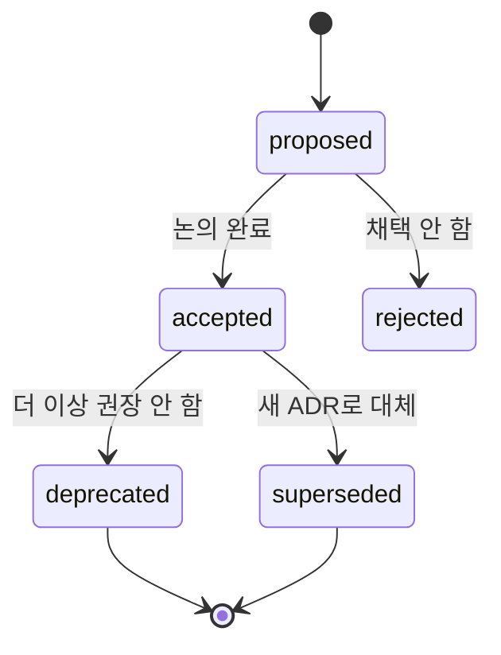

# Architecture Decision Records (ADR)

> Akiflow 통합 CLI + MCP 프로젝트의 주요 아키텍처 결정 기록. MADR 2.x 포맷.

## 1. ADR 목적

- 결정의 **맥락(Context)**, **고려한 대안(Options)**, **선택 이유(Decision Outcome)**, **결과(Consequences)**를 기록한다
- 재방문 트리거(Revisit Trigger)를 명시하여 나중에 결정이 유효한지 재검증 가능
- TASK 구현 시 "왜 이렇게 했는가"를 추적할 수 있도록 역참조 제공

## 1.1 참조 레퍼런스 익명화 정책

본 프로젝트는 Akiflow 내부 API를 역공학하는 성격상, 참조한 커뮤니티 오픈소스 구현체들을 **개인 계정명 없이 패턴 중심으로** 익명화하여 기재한다.

| 레퍼런스 식별자 | 특징 |
|----------------|------|
| **레퍼런스 A** | Akiflow MCP 서버. `refresh_token` 환경변수 방식, `POST /oauth/refreshToken` 호출로 v5 API 접근 |
| **레퍼런스 B** | Akiflow MCP 서버. Puppeteer로 브라우저를 띄워 로그인 후 토큰 캡처 |
| **레퍼런스 C** | Bun 기반 Akiflow CLI. IndexedDB LevelDB + 암호화 쿠키 직접 파싱으로 무인 토큰 추출 |
| **레퍼런스 D** | 동일하게 공식 API 없는 서비스(NotebookLM) 대상 MCP+CLI 듀얼 구현. CDP 기반 쿠키 추출 + 3계층 인증 복구 패턴 제공 |

이 4개 레퍼런스의 장점을 ADR-0003에서 하이브리드로 통합한다.

## 2. ADR 목록

### Tier 0: 기반 선택 (운영/인프라 결정)

| # | 제목 | 상태 | 주제 | 관련 TASK |
|---|------|------|------|----------|
| [ADR-0001](./ADR-0001-runtime-selection-bun.md) | 런타임 선택 — Bun | accepted | Bun vs Node vs Deno | TASK-01, TASK-20 |
| [ADR-0002](./ADR-0002-cli-mcp-entrypoint-pattern.md) | CLI + MCP 진입점 패턴 | accepted | 단일 진입점 + `--mcp` 플래그 | TASK-01, TASK-14, TASK-17 |
| [ADR-0003](./ADR-0003-akiflow-authentication-strategy.md) | Akiflow 인증 전략 | accepted | 4단계 계층 + 3계층 복구 | TASK-03~06, 18, 19 |
| [ADR-0004](./ADR-0004-release-automation-semantic-release.md) | 릴리즈 자동화 | accepted | semantic-release | TASK-01, TASK-20 |
| [ADR-0005](./ADR-0005-git-hooks-pre-commit.md) | Git 훅 관리 | accepted | Python pre-commit | TASK-01, TASK-20, TASK-22 |
| [ADR-0021](./ADR-0021-bun-only-distribution.md) | 배포 전략 — Bun-Only | accepted | npm 패키지 런타임 타겟 / sqlite / 패키지 크기 | v1.0.4 publish 재발 방지 |

### Tier 1: 코드 아키텍처 (핵심 설계)

| # | 제목 | 상태 | 주제 | 관련 TASK |
|---|------|------|------|----------|
| [ADR-0006](./ADR-0006-hexagonal-architecture.md) | 코드 아키텍처 — Hexagonal | accepted | Ports & Adapters 구조 | TASK-02, 06, 07, 04, 18 |
| [ADR-0007](./ADR-0007-mcp-tool-design-principles.md) | MCP Tool 설계 원칙 | accepted | Outcome-first, verb_noun, isError | TASK-15, 16 |
| [ADR-0008](./ADR-0008-error-handling-strategy.md) | 에러 처리 전략 | accepted | Typed Errors + Boundary 변환 | TASK-02, 전체 |

### Tier 2: 운영 품질

| # | 제목 | 상태 | 주제 | 관련 TASK |
|---|------|------|------|----------|
| [ADR-0009](./ADR-0009-logging-strategy.md) | 로깅 전략 | accepted | stdout 보호 + 구조화 + 마스킹 | TASK-14, 15, 16, 09~13 |
| [ADR-0010](./ADR-0010-cqrs-partial-adoption.md) | CQRS 부분 적용 | accepted | Read/Write 서비스 분리 | TASK-07, 08, 10, 15 |
| [ADR-0012](./ADR-0012-configuration-layered.md) | 설정 관리 | accepted | 계층적 env + XDG 파일 | TASK-03, 08, 18, 22 |

### Tier 3: 세부 설계

| # | 제목 | 상태 | 주제 | 관련 TASK |
|---|------|------|------|----------|
| [ADR-0011](./ADR-0011-dependency-injection.md) | 의존성 주입 | accepted | 수동 DI + Composition Root | TASK-06, 07, 09, 14 |
| [ADR-0013](./ADR-0013-local-cache-strategy.md) | 로컬 캐시 전략 | accepted | sync_token + TTL + Pending Queue | TASK-07, 08, 10 |
| [ADR-0014](./ADR-0014-async-retry-pattern.md) | 비동기/재시도 패턴 | accepted | Exponential Backoff + Jitter | TASK-05, 06, 07, 08, 18 |
| [ADR-0015](./ADR-0015-testing-strategy.md) | 테스트 전략 | accepted | Test Diamond + Port Mocking | 전체 TASK |

## 3. ADR 관계 다이어그램



**주요 연결 관계:**
- **ADR-0001 → ADR-0002**: Bun이 `--compile` 지원하므로 단일 진입점 바이너리화 가능
- **ADR-0001 → ADR-0003**: Bun의 `bun:sqlite` 내장으로 Chrome 쿠키 DB 접근
- **ADR-0001 → ADR-0021**: 개발 런타임이 Bun이라는 전제에서 "배포 아티팩트도 Bun 전용"으로 확장
- **ADR-0003 -.-> ADR-0021**: Chrome cookie(`bun:sqlite`) 의존성이 ADR-0021 결정의 핵심 제약
- **ADR-0004 -.-> ADR-0021**: semantic-release 파이프라인이 ADR-0021의 최종 아티팩트(Bun 번들)를 게시
- **ADR-0002 → ADR-0006**: 단일 진입점이 core 계층 공유를 전제로 함
- **ADR-0006 → ADR-0011**: Port 구현체를 Composition Root에서 수동 주입
- **ADR-0006 → ADR-0007**: MCP Tool은 core Service를 호출하는 primary adapter
- **ADR-0007 → ADR-0008**: Tool의 isError 패턴이 boundary 변환 규칙
- **ADR-0010 → ADR-0013**: CQRS의 Read 경로가 캐시 전략의 주요 클라이언트
- **ADR-0010 → ADR-0014**: Command의 pending queue가 재시도 패턴 활용
- **ADR-0006 → ADR-0015**: Hexagonal의 Port 구조가 테스트 mock 전략 근거

## 4. 정합성 이슈 ↔ ADR 매핑

README의 정합성 검증 결과와 ADR의 결정 근거가 일관되어야 한다.

| 정합성 이슈 | 해결 ADR | 해결 방식 |
|-----------|---------|---------|
| H1: PATCH UPSERT | ADR-0008 | CreateTaskPayload에 클라이언트 UUID 필드 + TaskCommandService에서 `crypto.randomUUID()` 생성 |
| H2: MCP stdout 오염 | ADR-0002, ADR-0009 | 단일 진입점 분기 + LoggerPort 강제(console.log 금지) |
| H3: macOS Keychain | ADR-0003 | 방식 2 실패 시 방식 1(IndexedDB)로 graceful fallback |
| M1: citty `--mcp` 충돌 | ADR-0002 | citty 초기화 전 분기 |
| M2: CDP Chrome 경로 | ADR-0003 | 단계 3 CDP의 OS별 경로 감지 로직 |
| M3: refresh_token rotation | ADR-0003 | 복구 계층 1에서 새 refresh_token 저장 |
| M4: Node 22+ 요구 | ADR-0004 | CI에 setup-bun + setup-node 병행 |
| M5: pre-commit Python | ADR-0005 | 개발자 온보딩 가이드(docs/CONTRIBUTING.md) 제공 |
| L1: pending 태스크 충돌 | ADR-0013, ADR-0014 | sync_token 기반 UPSERT + 서버 응답 권위 + 재시도 예산 |
| L2: zsh completion 버그 | 없음 (구현 이슈) | TASK-13에서 직접 해결 |

## 5. ADR 작성 규칙

### 5.1 상태(status) 전이



- **proposed**: 작성 중, 아직 결정 전
- **accepted**: 결정 확정, 구현 진행
- **rejected**: 고려했으나 채택 안 함 (기록 유지)
- **deprecated**: 과거에는 유효했으나 현재 권장 안 함
- **superseded by ADR-XXXX**: 새 ADR로 대체됨 (링크 필수)

### 5.2 번호 체계

- 4자리 숫자 (`ADR-0001`, `ADR-0042`)
- 기록 순서대로 증가, 삭제하지 않음
- superseded 시에도 원본 유지, 새 ADR 추가

### 5.3 파일 명명 규칙

```
ADR-{번호:4자리}-{kebab-case-주제}.md
예: ADR-0001-runtime-selection-bun.md
```

### 5.4 Revisit Trigger

모든 ADR은 "언제 이 결정을 재검토해야 하는가"를 명시한다. 예:
- 의존성 버전 메이저 변경
- 외부 API 스키마 변경
- 팀/조직 표준 변경
- 사용자 규모/요구사항 변경

## 6. 향후 추가 후보 ADR

프로젝트 진행 중 결정되면 추가할 수 있는 주제들:

- **ADR-0016 (proposed)**: 지원 OS/브라우저 매트릭스 (Windows 지원 범위)
- **ADR-0017 (proposed)**: MCP Resources/Prompts 제공 여부 (Tool 외 primitive 활용)
- **ADR-0018 (proposed)**: Observability — metrics/tracing 도입 시점
- **ADR-0019 (proposed)**: 플러그인/확장 메커니즘 (custom auth source 등)
- **ADR-0020 (proposed)**: 다국어 지원(i18n) 전략
- ~~ADR-0021 (proposed)~~: accepted로 전환 → [ADR-0021: 배포 전략 — Bun-Only](./ADR-0021-bun-only-distribution.md)

## 7. References

- [MADR 2.x 포맷](https://adr.github.io/madr/)
- [ADR GitHub Organization](https://adr.github.io/)
- [Michael Nygard의 ADR 원본 제안](https://cognitect.com/blog/2011/11/15/documenting-architecture-decisions)
