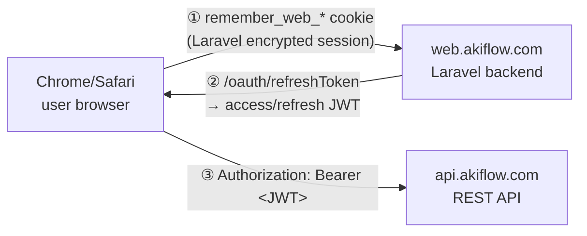
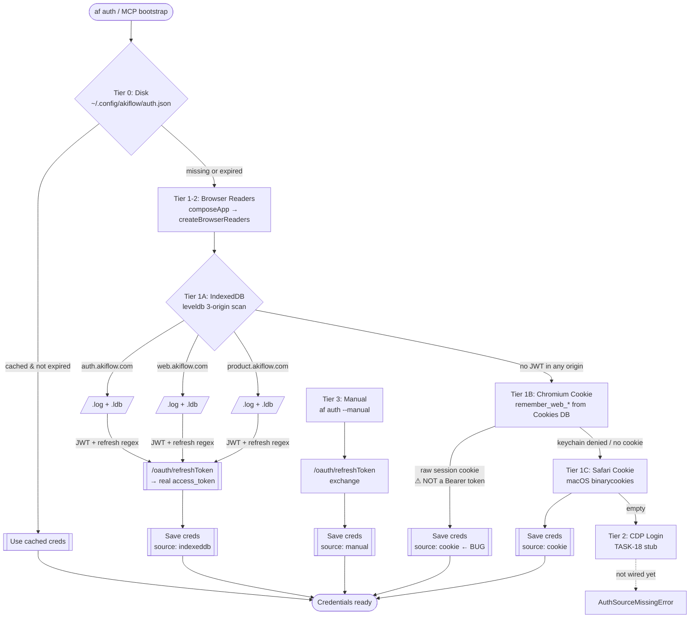
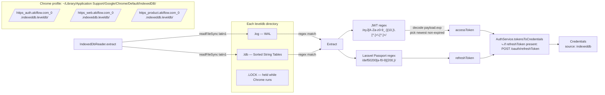
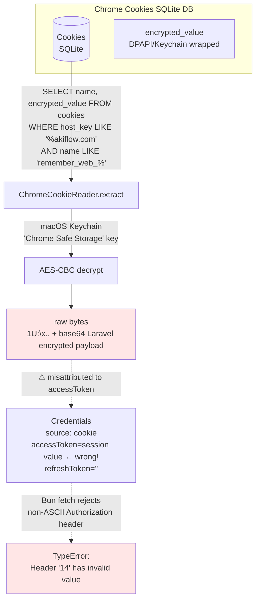
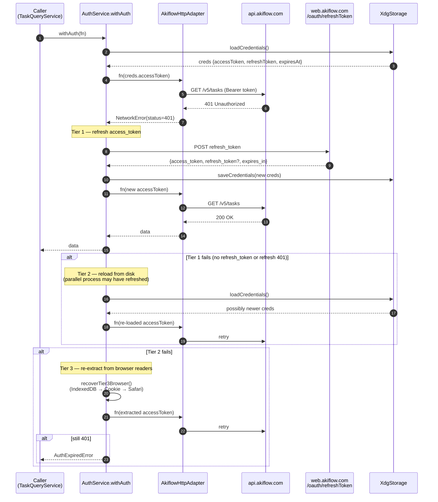

# Akiflow Token Acquisition Flow

`akiflow-toolkit`은 Akiflow 공식 API 토큰 발급 체계가 없는 **역공학 CLI/MCP 툴킷**이다. Akiflow 웹앱이 Chrome/Safari에 남긴 흔적에서 유효한 토큰을 추출하거나, 사용자가 수동 입력한 refresh_token을 서버에서 교환해 Bearer JWT를 확보한다. 본 문서는 그 과정을 계층별로 설명한다.

관련 ADR:
- **ADR-0003**: 3-tier recovery (disk → browser → CDP)
- **ADR-0006**: Hexagonal architecture (Port-driven)
- **ADR-0011**: Composition root
- **TASK-18**: CDP login wiring (아직 미완성)

---

## 1. Akiflow의 이중 인증 체계

Akiflow는 **서로 다른 두 인증 체계**를 동시에 운용한다.



| 체계 | 발급자 | 포맷 | 목적 | 저장 위치 |
|------|-------|------|------|-----------|
| **Laravel 세션 쿠키** | `web.akiflow.com` backend | `eyJpdiI:...,"value":"...","mac":"..."` (Laravel `encrypt()` output) | 웹앱 SSO/세션 유지 | Chrome `Cookies` DB의 `remember_web_*` |
| **OAuth Passport 토큰** | `web.akiflow.com/oauth/refreshToken` | `access_token`: JWT 3-part / `refresh_token`: Laravel Passport encrypted hex (`def50200...`) | API Bearer 인증 | 웹앱 SPA가 IndexedDB에 저장 |

**핵심**: REST API (`api.akiflow.com`)는 반드시 **JWT Bearer**를 요구한다. 세션 쿠키는 Laravel 백엔드 내부용이라 **API로 보내면 `TypeError: Header has invalid value`** 로 Bun fetch가 reject한다.

---

## 2. 4-Tier Hierarchical Cascade

`AuthService.authenticate()`가 순서대로 시도한다. 먼저 성공한 tier에서 멈춘다.



### Tier 순서 요약

| # | Tier | 구현체 | 성공 시 source |
|---|------|-------|---------------|
| 0 | Disk (stored) | `XdgStorage` | 기존값 유지 |
| 1A | Chromium IndexedDB | `IndexedDbReader` × (auth → web → product 3 origin) | `indexeddb` |
| 1B | Chromium Cookie DB | `ChromeCookieReader` | `cookie` ⚠ |
| 1C | Safari Cookie | `SafariCookieReader` (macOS only) | `cookie` ⚠ |
| 2 | CDP Login | `CdpBrowserLogin` (stub — TASK-18) | `cdp` (미구현) |
| 3 | Manual | `setManualToken` | `manual` |

---

## 3. Tier 1A — IndexedDB (권장 경로)

**가장 안정적이고 권장되는 경로.** 3개 origin의 leveldb 디렉토리를 우선순위 순으로 스캔한다.



### leveldb 파일 구조

| 파일 | 역할 |
|------|------|
| `CURRENT` | 현재 참조 중인 manifest 파일명 |
| `MANIFEST-xxxxxx` | version, SST 목록, compaction 메타 |
| `000xxx.log` | **Write-Ahead Log** (최근 write) |
| `000xxx.ldb` | **Sorted String Table** (compact된 영속 데이터) |
| `LOCK` | 프로세스 단일 접근 보장 — Chrome 실행 중엔 holding |
| `LOG`, `LOG.old` | leveldb 내부 디버그 로그 |

**이 프로젝트의 기술적 트릭**: 네이티브 leveldb 파서 없이 `.log`와 `.ldb`를 `latin1`로 읽고 **정규식 매칭**만으로 JWT/refresh를 추출한다. Bun 단일 바이너리만으로 동작하고 leveldb 포맷 변경에도 상당히 견고.

### 3-origin 우선순위 배경

Akiflow는 역사적으로 `web.akiflow.com` 단일 origin이었으나, 최근 `auth.akiflow.com` (OAuth), `product.akiflow.com` (앱 상태)로 분리하는 단계에 있다. 어느 origin에 최신 토큰이 있는지 보장이 없으므로 **모두 스캔**하되 `auth` → `web` → `product` 순으로 우선.

---

## 4. Tier 1B — Chromium Cookie (주의)

⚠ **현재 misattribution 버그가 있는 경로.**



`remember_web_*` 쿠키는 Laravel이 세션 식별용으로 발급한 **암호화 세션 쿠키**다. 현재 `ChromeCookieReader`가 이를 그대로 `accessToken` 필드에 저장해서 `AkiflowHttpAdapter`가 `Authorization: Bearer <raw bytes>`로 보내면:

1. raw bytes에 non-ASCII / control 문자 포함
2. Bun fetch가 HTTP 헤더 값 검증에서 `TypeError: Header has invalid value` throw
3. `AkiflowHttpAdapter`가 이를 `NetworkError("fetch failed")`로 래핑
4. `toolError`가 `err.cause`를 로깅 안 해 사용자에게 "네트워크 문제"로 오인됨

**후속 fix**: reader가 refresh_token을 확보하지 못했을 때는 `null`을 반환해서 다음 tier로 넘기게 수정.

---

## 5. `withAuth()` Tier 1-3 런타임 복구

최초 인증 후에도 API 401이 발생하면 `withAuth`가 자동 복구를 시도한다.



---

## 6. Token 포맷 레퍼런스

### Access Token (JWT)
Laravel Passport가 발급하는 3-part base64url. `indexeddb-reader.ts`의 정규식:

```
JWT_RE = /eyJ[A-Za-z0-9_-]{10,}\.[A-Za-z0-9_-]+\.[A-Za-z0-9_-]+/g
```

Payload 디코드 시 `exp` 필드(seconds epoch)로 만료 여부 판단. 여러 JWT 후보 중 `exp`가 가장 먼 것 선택.

**예시 (redacted)**:
```
eyJ0eXAiOiJKV1QiLCJhbGciOiJSUzI1NiIs... . eyJpc3MiOiJhcGkuYWtpZmxvdy5jb20i... . <signature>
```

### Refresh Token (Laravel Passport encrypted)
`def50200` prefix + 200자 이상 hex. 암호학적 블록:

```
REFRESH_RE = /def50200[a-f0-9]{200,}/
```

**용도**: `/oauth/refreshToken` POST body의 `refresh_token` 필드로 보내면 새 `access_token` 발급.

### Laravel 세션 쿠키 (혼동 주의)
`remember_web_<hash>` 쿠키 값. Laravel `encrypt()` output:

```
{"iv":"<base64>","value":"<base64-AES>","mac":"<hex>","tag":""}
```
를 base64+URL-encode 한 형태. **API Bearer로 절대 사용 불가**.

---

## 7. 파일 & 경로 참조

| 경로 | 역할 |
|------|------|
| `~/.config/akiflow/auth.json` | 최종 저장된 Credentials (source, accessToken, refreshToken, expiresAt) |
| `~/Library/Application Support/Google/Chrome/Default/IndexedDB/https_*akiflow*_0.indexeddb.leveldb/` | IndexedDB 스캔 대상 (3 origin) |
| `~/Library/Application Support/Google/Chrome/Default/Cookies` | Chromium cookie SQLite DB |
| `~/Library/Cookies/Cookies.binarycookies` | Safari binary cookies (macOS) |
| `src/core/services/auth-service.ts` | 4-tier orchestrator |
| `src/adapters/browser/indexeddb-reader.ts` | leveldb 패턴 매칭 reader |
| `src/adapters/browser/chrome-cookie.ts` | Cookie DB reader (⚠ misattribution bug) |
| `src/adapters/browser/safari-cookie.ts` | Safari binary cookies parser |
| `src/adapters/browser/cdp-launcher.ts` | CDP login (기능은 있으나 wiring 미완) |
| `src/adapters/http/token-refresh.ts` | `/oauth/refreshToken` POST |
| `src/adapters/http/akiflow-api.ts` | REST API adapter (`api.akiflow.com`) |

---

## 8. 알려진 실패 모드

| 증상 | 원인 | 해결 |
|------|------|------|
| `TypeError: Header '14' has invalid value` | Cookie tier misattribution: `remember_web_*` raw bytes가 accessToken에 들어감 | Chrome 종료 + `af auth logout` + `af auth` (IndexedDB tier 승격) |
| `[indexeddb] path not found` | `auth.akiflow.com` origin이 비어있거나 업데이트 전 | `web.akiflow.com`으로 자동 fallback (우선순위 배열) |
| `fetch failed: GET /v5/tasks` (HTTP status 없음) | 헤더 invalid 또는 DNS/TLS | `mcp-api-probe.ts`로 cause 확인 |
| `AuthExpiredError: all recovery tiers exhausted` | 진짜 만료 + 모든 tier 실패 | `af auth --manual`로 refresh_token 수동 입력 |
| `AuthSourceMissingError: all sources exhausted` | Chrome 미설치 / 로그인한 적 없음 | `af auth --manual` |
| 401만 계속 | 서버가 토큰 거절 | refresh_token이 revoke됐을 가능성 → `af auth --manual`로 새 발급 |

---

## 9. 즉시 실행 가능한 진단 커맨드

```bash
# ① 저장된 credential 진단
bun run scripts/mcp-api-probe.ts

# ② MCP 서버 end-to-end 실행
bun run scripts/mcp-live-demo.ts

# ③ 강제 재인증 (stale cookie tier 데이터 제거 후 IndexedDB 재스캔)
osascript -e 'tell application "Google Chrome" to quit'
bun run src/index.ts auth logout
bun run src/index.ts auth
bun run src/index.ts auth status   # source: indexeddb 기대

# ④ Manual 경로 (refresh_token 직접 입력)
bun run src/index.ts auth --manual
```

---

## 10. 개선 후보 (Follow-up Tasks)

1. **Cookie tier misattribution 수정** — reader가 refresh 또는 JWT를 못 찾으면 `null` 반환
2. **CDP login wiring (TASK-18)** — `CdpBrowserLogin`을 `authenticate()`에서 호출
3. **NetworkError cause 보존** — `toolError`가 `err.cause`를 로깅에 포함하도록
4. **IndexedDB origin 자동 발견** — 상수 3개가 아닌 `ls IndexedDB/https_*akiflow*` 로 동적 감지
5. **Keychain access 예외 처리 개선** — macOS keychain prompt 실패 시 명확한 에러 메시지

---

## 관련 문서

- `artifacts/deps-review/TASK-cache-invalidation-on-writes.md` — write 후 read 캐시 반영
- `artifacts/deps-review/TASK-zod-v4-migration.md` — MCP SDK 타입 호환성 대기
- `docs/adr/ADR-0003-authentication-recovery.md` (있다면)
- `docs/adr/ADR-0006-hexagonal-architecture.md`
- `docs/adr/ADR-0011-dependency-injection.md`
